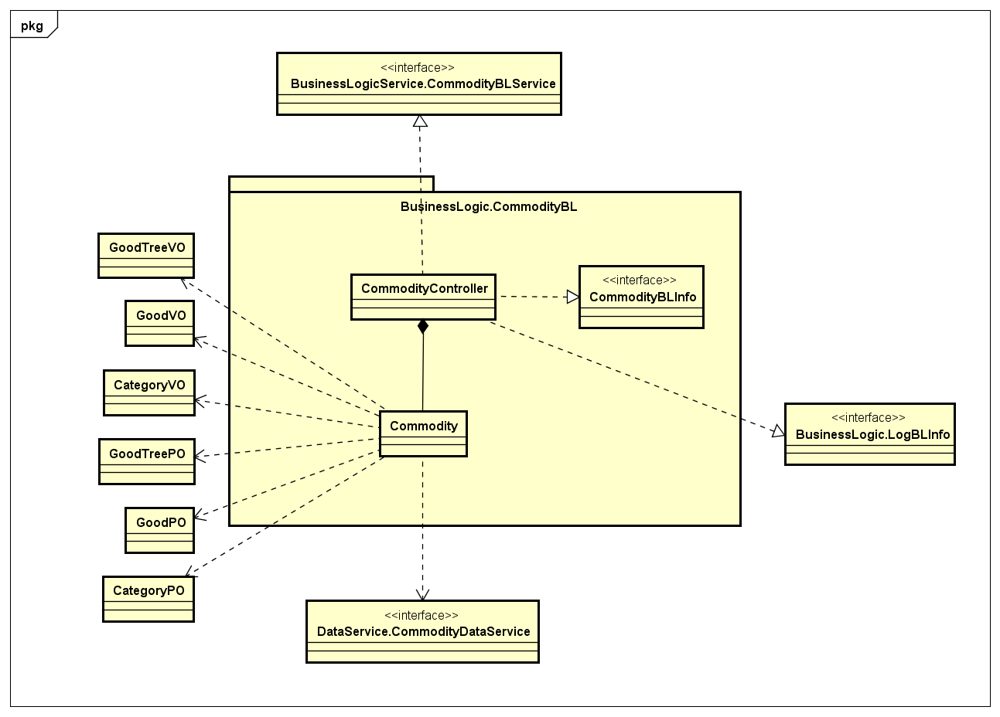
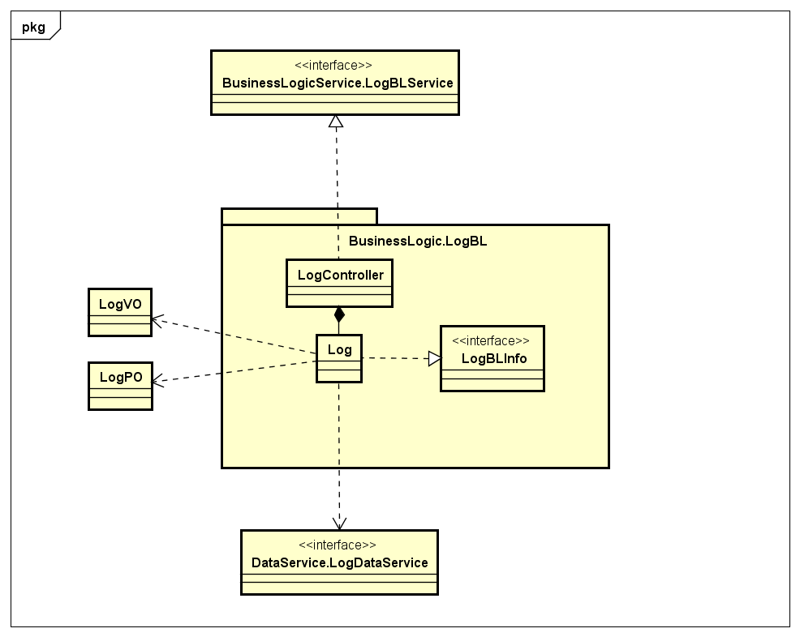

# 进销存系统软件详细设计描述文档

> **作者**：杨郁芩，邱浩旻，冉杰文，尚柯宇

## 目录

[TOC]

## 更新历史

| 更新人员            | 更新时间       | 更新内容 | 版本号  |
| :-------------- | ---------- | ---- | ---- |
| 杨郁芩、邱浩旻、冉杰文、尚柯宇 | 2017-10-29 | 最初草稿 | v0.9 |
|                 |            |      |      |

## 1. 引言

### 1.1 编制目的

本报告详细完成对进销存系统的详细设计，达到指导后续软件构造的目的，同时实现和测试人员及用户的沟通。

本报告面向开发人员、测试人员以及最终用户而编写，是了解系统的导航。

### 1.2 参考资料

进销存系统用例描述文档

进销存系统软件需求规格说明文档

进销存系统体系结构设计文档

## 2. 产品概述

参考进销存系统用例文档和进销存系统软件需求规格说明文档中对产品的概括描述。

## 3. 体系结构设计概述

参考进销存系统概要设计文档中体系结构设计的概述

## 4. 结构视角

### 4.1 展示层的分解

#### 4.1.1 MainUI 模块

1. **模块概述**

   ​

2. **整体结构**

3. **模块内部类的借口规范**

4. **展示层的动态模型**

5. **展示层的设计原理**

#### 4.1.2 UserUI 模块

1. **模块概述**

2. **整体结构**

3. **模块内部类的借口规范**

4. **展示层的动态模型**

5. **展示层的设计原理**

#### 4.1.3 BookUI 模块

1. **模块概述**

2. **整体结构**

3. **模块内部类的借口规范**

4. **展示层的动态模型**

5. **展示层的设计原理**

#### 4.1.4 CustomerUI 模块

1. **模块概述**

2. **整体结构**

3. **模块内部类的借口规范**

4. **展示层的动态模型**

5. **展示层的设计原理**

#### 4.1.5 AccountUI 模块

1. **模块概述**

2. **整体结构**

3. **模块内部类的借口规范**

4. **展示层的动态模型**

5. **展示层的设计原理**

#### 4.1.6 DocUI 模块

1. **模块概述**

2. **整体结构**

3. **模块内部类的借口规范**

4. **展示层的动态模型**

5. **展示层的设计原理**

#### 4.1.7 StrategyUI 模块

1. **模块概述**

2. **整体结构**

3. **模块内部类的借口规范**

4. **展示层的动态模型**

5. **展示层的设计原理**

#### 4.1.8 CommodityUI 模块

1. **模块概述**
2. **整体结构**

3. **模块内部类的借口规范**

4. **展示层的动态模型**

5. **展示层的设计原理**

#### 4.1.9 LogUI 模块

1. **模块概述**

2. **整体结构**

3. **模块内部类的借口规范**

4. **展示层的动态模型**

5. **展示层的设计原理**

### 4.2 业务逻辑层的分解

#### 4.2.1 Userbl 模块

##### 4.2.1.1. **模块概述**

   Userbl模块承担的需求参见需求规格说明文档功能需求以及相关非功能需求

   Userbl模块承担的职责及接口参见软件体系结构描述文档

##### 4.2.1.2. **整体结构**

根据体系结构的设计，我们将系统分为展示层、业务逻辑层、数据层。每一层之间为了增加灵活性，我们会添加接口。比如展示层和业务逻辑层之间，我们添加BLSerivice.UserBLService和BLService.UserLoginService接口。在业务逻辑层之间，我们添加DataService.UserDataService接口。为了隔离业务逻辑职责和逻辑控制职责，我们增加了UserController，这样UserController会将对系统账户管理的业务逻辑处理委托给User对象。UserPO是作为系统账户信息的持久化对象被添加到设计模型中的

**User模块各个类的设计**

**User模块各个类的职责**

| 模块             | 职责                                       |
| -------------- | ---------------------------------------- |
| UserController | 负责实现系统账户的登录登出及账户信息的管理，包括增删改查服务           |
| User           | 系统账户的领域模型对象，拥有用户数据的工号和密码及权限，可以帮助完成销售界面和登录界面所需要的服务 |

##### 4.2.1.3. **模块内部类的接口规范**

###### 4.2.1.3.1UserController的接口规范

**提供的服务**

| UserController.add                 |                                          |
| ---------------------------------- | ---------------------------------------- |
| 语法                                 | public ResultMessage add(UserVO vo)      |
| 前置条件                               | 已创建一个User领域对象，并且输入符合规则                   |
| 后置条件                               | 调用User领域对象的add方法                         |
| **UserController.delete**          |                                          |
| 语法                                 | public ResultMessage delete(String id)   |
| 前置条件                               | 已创建一个User领域对象，并且输入符合规则                   |
| 后置条件                               | 调用User领域对象的delete方法                      |
| **UserController.updateLevel**     |                                          |
| 语法                                 | public ResultMessage updateLevel(UserVO uservo) |
| 前置条件                               | 已创建一个User领域对象，并且输入符合规则                   |
| 后置条件                               | 调用User领域对象的updateLevel方法                 |
| **UserController.search**          |                                          |
| 语法                                 | public ArrayList<UserVO> search(String id) |
| 前置条件                               | 已创建一个User领域对象，并且输入符合规则                   |
| 后置条件                               | 调用User领域对象的search方法                      |
| **UserController.getAllUser**      |                                          |
| 语法                                 | public ArrayList<UserVO> getAllUser()    |
| 前置条件                               | 已创建一个User领域对象                            |
| 后置条件                               | 调用User领域对象的getAllUser方法                  |
| **UserController.getInfo**         |                                          |
| 语法                                 | public UserVO getInfo(String id)         |
| 前置条件                               | 已创建一个User领域对象                            |
| 后置条件                               | 调用User领域对象的getInfo方法                     |
| **UserController.login**           |                                          |
| 语法                                 | public LoginState login(String id,long password) |
| 前置条件                               | 已创建一个User领域对象，并且输入符合规则                   |
| 后置条件                               | 调用User领域对象的login方法                       |
| **UserController.logout**          |                                          |
| 语法                                 | public LoginState logout()               |
| 前置条件                               | 已创建一个User领域对象                            |
| 后置条件                               | 调用User领域对象的logout方法                      |
| **UserController.reset**           |                                          |
| 语法                                 | public ResultMessage reset(String userID,String oldPassword,String newPassword) |
| 前置条件                               | 已创建一个User领域对象，并且输入符合规则                   |
| 后置条件                               | 调用User领域对象的reset方法                       |
| **UserController.getCurrentLevel** |                                          |
| 语法                                 | public UserLevel getCurrentUserLevel(String id) |
| 前置条件                               | 已创建一个User领域对象                            |
| 后置条件                               | 调用User领域对象的getCurrentLevel方法             |

| 需要的服务名                   | 服务                    |
| ------------------------ | --------------------- |
| User.addUser             | 新增系统账户，并自动生成工号，更新账户列表 |
| User.deleteUser          | 删除系统账户，并更新账户列表        |
| User.updateLevel         | 修改系统账户权限              |
| User.search              | 根据工号查询系统账户            |
| User.getAllUser          | 获得所有的用户列表             |
| User.getInfo             | 获得选中用户的所有信息           |
| User.login               | 启动一个账户登录回合            |
| User.logout()            | 启动一个账户登出回合            |
| User.resetPassword       | 启动一个账户修改密码回合          |
| User.getCurrentUserLevel | 得到当前操作员的权限            |

###### 4.2.1.3.2User的接口规范

**提供的服务**

| User.addUser                 |                                          |
| ---------------------------- | ---------------------------------------- |
| 语法                           | public ResultMessage addUser(UserVO vo)  |
| 前置条件                         | 启动一个新增系统账户回合，并自动生成工号                     |
| 后置条件                         | 返回新增成功与否，在一个新增账户回合中，新增选定权限的账户            |
| **User.deleteUser**          |                                          |
| 语法                           | public ResultMessage deleteUser(String id) |
| 前置条件                         | 启动一个删除系统账户回合                             |
| 后置条件                         | 返回删除成功与否，在一个删除账户回合中，删除选定账户               |
| **User.updateLevel**         |                                          |
| 语法                           | public ResultMessage updateLevel(Level level) |
| 前置条件                         | 启动一个修改权限回合                               |
| 后置条件                         | 返回修改成功与否，在一个修改权限回合中，保存修改后权限              |
| **User.search**              |                                          |
| 语法                           | public ArrayList<UserVO> search(String ID) |
| 前置条件                         | 启动一个查询账户回合                               |
| 后置条件                         | 返回查询成功与否，在一个查询回合中，显示查询结果                 |
| **User.getAllUser**          |                                          |
| 语法                           | public ArrayList<UserVO> getAllUser()    |
| 前置条件                         | 启动一个获得所有用户回合                             |
| 后置条件                         | 返回数据库中所有用户组成的列表                          |
| **User.getInfo**             |                                          |
| 语法                           | public UserVO getInfo(String ID)         |
| 前置条件                         | 启动一个获得当前用户全部信息回合                         |
| 后置条件                         | 返回所选用户的所有信息                              |
| **User.login**               |                                          |
| 语法                           | public LoginState login(String id,String password) |
| 前置条件                         | 启动一个登陆回合                                 |
| 后置条件                         | 更新登录状态                                   |
| **User.logout**              |                                          |
| 语法                           | public LoginState Logout()               |
| 前置条件                         | 用户已登录                                    |
| 后置条件                         | 更新登录状态                                   |
| **User.resetPassword**       |                                          |
| 语法                           | public ResultMessage resetPassword(String id,String oldPassword,String newPassword) |
| 前置条件                         | 启动一个修改密码回合                               |
| 后置条件                         | 返回密码修改成功与否                               |
| **User.getCurrentUserLevel** |                                          |
| 语法                           | public Level getCurrentUserLevel(String id) |
| 前置条件                         | 用户登录成功                                   |
| 后置条件                         | 返回当前操作员权限                                |

| 需要的服务名                              | 服务            |
| ----------------------------------- | ------------- |
| UserDataService.insert              | 插入单一持久化对象     |
| UserDataService.delete              | 删除单一持久化对象     |
| UserDataService.modifyLevel         | 修改单一持久化对象     |
| UserDataService.find                | 根据ID查找单一持久化对象 |
| UserDataService.getAllUser          | 获得数据库中所有对象    |
| UserDataService.getInfo             | 获得选定对象的所有信息   |
| UserDataService.login               | 用户登录          |
| UserDataService.resetPassword       | 用户修改密码        |
| UserDataService.getCurrentUserLevel | 获得用户权限        |

   ​

#####4.2.1.4. **业务逻辑层的动态模型**

   **新增系统账户的顺序图**

   

   **登录的顺序图**

   

##### 4.2.1.5. **业务逻辑层的设计原理**

   利用委托式控制风格，每个界面需要访问的业务逻辑由各自的控制器委托给不同的领域对象。

#### 4.2.2 Bookbl 模块

##### 4.2.2.1. **模块概述**

 Bookbl模块承担的需求参见需求规格说明文档功能需求以及相关非功能需求

 Bookbl模块承担的职责及接口参见软件体系结构描述文档

##### 4.2.2.2. **整体结构**

我们在展示层和业务逻辑层之间，添加了BLSerivice.BookBLService接口。为了隔离业务逻辑职责和逻辑控制职责，我们增加了BookController，这样BookController会将对期初建账的业务逻辑处理委托给Book对象。BookPO是作为系统账户信息的持久化对象被添加到设计模型中的

**Bookbl模块各个类的设计**

  BookBL各个类的职责如下表所示

| 模块             | 职责                                 |
| -------------- | ---------------------------------- |
| BookController | 负责实现期初建账界面所需要的全部服务                 |
| Book           | 期初建账的领域模型，拥有期初建账的信息，可以完成期初建账所需要的服务 |

##### 4.2.2.3. **模块内部类的接口规范**

###### 4.2.2.3.1 BookController的接口规范

**提供的服务**

| BookController.addBook      |                                         |
| --------------------------- | --------------------------------------- |
| 语法                          | public ResultMessage addBook(BookVO vo) |
| 前置条件                        | 已创建Book领域对象                             |
| 后置条件                        | 调用Book领域对象的addBook方法                    |
| **bookController.readBook** |                                         |
| 语法                          | public BookVO readBook(Data data)       |
| 前置条件                        | 已创建Book领域对象                             |
| 后置条件                        | 调用Book领域对象的readBook方法                   |

**需要的服务**

| 名称            | 描述       |
| ------------- | -------- |
| Book.addBook  | 进行一次期初建账 |
| Book.readBook | 查看一次期初建账 |

###### 4.2.2.3.2 Book的接口规范

**提供的服务**

| Book.addBook      |                                         |
| ----------------- | --------------------------------------- |
| 语法                | public ResultMessage addBook(BookVO vo) |
| 前置条件              | 进行一次期初建账                                |
| 后置条件              | 返回期初建账结果                                |
| **Book.readBook** |                                         |
| 语法                | public BookVO readBook(Data data)       |
| 前置条件              | 进行一次查看期初建账操作                            |
| 后置条件              | 返回对应时间的期初建账信息                           |

**需要的服务**

| 名称                       | 描述         |
| ------------------------ | ---------- |
| BookDataService.addBook  | 进行一次期初建账   |
| BookDataService.readBook | 进行一次查看期初建账 |

##### 4.2.2.4. **业务逻辑层的动态模型**

##### 4.2.2.5. **业务逻辑层的设计原理**

#### 4.2.3 Customerbl 模块

##### 4.2.3.1. **模块概述**

   customerbl模块承担的需求参见需求规格说明文档功能需求以及相关非功能需求，模块的职责及接口参见软件体系结构设计文档

##### 4.2.3.2. **整体结构**

   根据体系结构的设计，我们将系统分为展示层、业务逻辑层、数据层，每一层之间为了增加灵活性，我们会添加接口。在展示层和业务逻辑层之间，添加BLService.CustomerBLService接口，业务逻辑层和数据层之间，添加DataService.CustomerDataService接口。为了隔离业务逻辑职责和逻辑控制职责，我们增加了CusManageController，这样CusManageController会将对客户的管理业务处理委托给Customer对象。CustomerPO是作为客户的持久化对象被添加到设计模型中的。

   **CustomerBL模块的设计**：

   

   **Customer模块各个类的职责**

| 模块                  | 职责                                |
| ------------------- | --------------------------------- |
| CusManageController | 负责实现客户管理界面所需要的服务                  |
| Customer            | 客户对象，拥有客户的属性信息，可以帮助完成客户管理界面所需要的服务 |

##### 4.2.3.3. **模块内部类的接口规范**

   **CusManageController的接口规范**

| CusManageController.addCustomer        |                                          |
| -------------------------------------- | ---------------------------------------- |
| 语法                                     | public ResultMessage addCustomer(CustomerVO customervo) |
| 前置条件                                   | 启动一个新增客户回合                               |
| 后置条件                                   | 调用Customer类的addCustomer方法                |
| **CusManageController.deleteCustomer** |                                          |
| 语法                                     | public ResultMessage deleteCustomer(String CustomerID) |
| 前置条件                                   | 启动一个删除客户回合                               |
| 后置条件                                   | 调用Customer类的deleteCustomer方法             |
| **CusManageController.modifyCustomer** |                                          |
| 语法                                     | public ResultMessage modifyCustomer(CustomerVO customervo) |
| 前置条件                                   | 启动一个修改客户信息回合                             |
| 后置条件                                   | 调用Customer类的modifyCustomer方法             |
| **CusManageController.search**         |                                          |
| 语法                                     | public ArrayList<CustomerVO> searchByName(String name) |
| 前置条件                                   | 启动一个根据客户名搜索客户回合                          |
| 后置条件                                   | 调用Customer类的searchByName方法               |
| **CusManageController.searchByID**     |                                          |
| 语法                                     | public CustomerVO searchByID(String ID)  |
| 前置条件                                   | 启动一个根据客户ID搜索客户回合                         |
| 后置条件                                   | 调用Customer类的searchByID方法                 |
| **CusManageController.getSupplier**    |                                          |
| 语法                                     | public ArrayList<CustomerVO> getSupplier() |
| 前置条件                                   | 得到供应商列表                                  |
| 后置条件                                   | 调用Customer的getSupplier方法                 |
| **CusManageController.getSaler**       |                                          |
| 语法                                     | public ArrayList<CustomerVO> getSaler()  |
| 前置条件                                   | 得到销售商列表                                  |
| 后置条件                                   | 调用Customer的getSaler方法                    |
| **CusManageController.getCustomer**    |                                          |
| 语法                                     | public ArrayList<CustomerVO >getCustomer() |
| 前置条件                                   | 根据ID获得客户信息                               |
| 后置条件                                   | 调用Customer的getCustomer方法                 |

| 需要的服务名                  | 服务           |
| ----------------------- | ------------ |
| Customer.addCustomer    | 新增一个客户对象     |
| Customer.deleteCustomer | 删除一个客户对象     |
| Customer.modifyCustomer | 修改一个客户对象的属性  |
| Customer.search         | 根据客户输入进行模糊查找 |
| Customer.searchByID     | 根据客户ID进行模糊查找 |
| Customer.getSupplier    | 得到供应商列表      |
| Customer.getSaler       | 得到销售商列表      |
| Customer.getCustomer    | 得到所有客户对象     |

   **Customer的接口规范**

| Customer.addCustomer        |                                          |
| --------------------------- | ---------------------------------------- |
| 语法                          | public ResultMessage addCustomer(CustomerVO customervo) |
| 前置条件                        | 被CusManageController调用，用户请求新增客户          |
| 后置条件                        | 更新数据库                                    |
| **Customer.deleteCustomer** |                                          |
| 语法                          | public ResultMessage deleteCustomer(String id) |
| 前置条件                        | 被CusManageController调用，用户请求删除客户          |
| 后置条件                        | 更新数据库                                    |
| **Customer.modifyCustomer** |                                          |
| 语法                          | public ResultMessage modifyCustomer(CustomerVO customervo) |
| 前置条件                        | 被CusManageController调用，用户请求修改客户信息        |
| 后置条件                        | 更新数据库                                    |
| **Customer.search**         |                                          |
| 语法                          | public ArrayList<CustomerVO> searchByName(String name) |
| 前置条件                        | 被CusManageController调用，用户请求根据客户输入进行模糊查找  |
| 后置条件                        | 返回查找结果                                   |
| **Customer.searchByID**     |                                          |
| 语法                          | public CustomerVO searchByID(String id)  |
| 前置条件                        | 被CusManageController调用，用户请求根据客户ID进行模糊查找  |
| 后置条件                        | 返回查找结果                                   |
| **Customer.getSupplier**    |                                          |
| 语法                          | public ArrayList<String> getSupplier()   |
| 前置条件                        | 被CusManageController调用，用户请求得到供货商列表       |
| 后置条件                        | 返回供货商列表                                  |
| **Customer.getSaler**       |                                          |
| 语法                          | public ArrayList<String> getSaler()      |
| 前置条件                        | 被CusManageController调用，用户请求得到销售商列表       |
| 后置条件                        | 返回销售商列表                                  |
| **Customer.getCustomer**    |                                          |
| 语法                          | public ArrayList<CustomerVO> getCustomer() |
| 前置条件                        | 被CusManageController调用，用户请求得到所有客户对象      |
| 后置条件                        | 返回对应客户对象                                 |

| 需要的服务名                                   | 服务                   |
| ---------------------------------------- | -------------------- |
| CustomerDataService.insert(CustomerPO customerpo) | 插入单一持久化对象            |
| CustomerDataService.delete(CustomerPO customerpo) | 删除单一持久化对象            |
| CustomerDataService.update(CustomerPO customerpo) | 更新单一持久化对象            |
| CustomerDataService.search(String name)  | 根据客户输入的字符串进行持久化对象的查找 |
| CustomerDataService.searchByID(String id) | 根据ID进行持久化对象的查找       |
| CustomerDataService.getCustomer()        | 得到所有客户单一持久化对象        |
| CustomerDataService.getSupplier()        | 得到供应商列表              |
| CustomerDataService.getSaler()           | 得到销售商列表              |

   ​

##### 4.2.3.4. **业务逻辑层的动态模型**

   **新增客户顺序图**

   

   **删除客户顺序图**

   

   **修改客户顺序图**

   

   **Customer的状态图**

   

##### 4.2.3.5. **业务逻辑层的设计原理**

   利用委托式的控制风格

#### 4.2.4 Accountbl 模块

##### 4.2.4.1 模块概述

   Accountbl模块承担的需求参见需求规格说明文档功能需求及相关非功能需求

   Accountbl模块承担的职责及接口参见软件体系结构描述文档5.3.2.4

##### 4.2.4.2  整体结构

在展示层和业务逻辑层之间添加BLService.AccountBL接口。业务逻辑层和数据层之间添加DataService.AccountDataService接口。为了隔离业务逻辑职责和逻辑控制职责，我们增加了AccountController,这样AccountContrller会把管理银行账户的业务逻辑处理委托给Account对象。AccountPO是为了作为银行账户的持久化对象存在的被添加到设计模型中的。为了给业务逻辑层的其他包获取和改动银行账户信息，根据依赖倒置原则，我们还实现了BLInfo.AccountInfo接口

**Account模块各个类的设计**

  **AccountBL各个类的职责**

| 模块                | 职责                                       |
| ----------------- | ---------------------------------------- |
| AccountController | 负责实现管理银行账户界面所需要的服务以及实现为逻辑层实际的Info接口      |
| Account           | 银行账户的领域模型，拥有余额、账户名称和账户号码可以完成银行账户管理所需要的服务 |

##### 4.2.4.3 模块内部类的接口规范

######  4.2.4.3.1 AccountController的接口规范

**提供的服务**

| AccountController.getAccountList    |                                          |
| ----------------------------------- | ---------------------------------------- |
| 语法                                  | public ArrayList<AccountVO> getAccountList() |
| 前置条件                                | 已创建一个Account领域对象                         |
| 后置条件                                | 调用Account领域对象的getAccountList方法           |
| **AccountController.getInfo**       |                                          |
| 语法                                  | public  AccountVO getInfo(String id)     |
| 前置条件                                | 已创建一Aaccount领域对象                         |
| 后置条件                                | 调用Account领域对象的getInfo方法                  |
| **AccountController.updateBalance** |                                          |
| 语法                                  | public ResultMessage updateBalance(long amount) |
| 前置条件                                | 已创建一个Account领域对象                         |
| 后置条件                                | 调用Account领域对象的的updateBalance方法           |
| **AccountController.updateName**    |                                          |
| 语法                                  | public ResultMessage updateName(String name) |
| 前置条件                                | 已创建一个Account领域对象                         |
| 后置条件                                | 调用Account领域对象的的updateName方法              |
| **AccountController.newAccount**    |                                          |
| 语法                                  | public ResultMessage newAccount (AccountVO account) |
| 前置条件                                | 已创建一个Account领域对象                         |
| 后置条件                                | 调用Account领域对象的add方法                      |
| **AccountController.delete**        |                                          |
| 语法                                  | public ResultMessage delete(AccountVO account) |
| 前置条件                                | 已创建一个Account领域对象                         |
| 后置条件                                | 调用Account领域对象的del方法                      |
| **AccountController.search**        |                                          |
| 语法                                  | public  ArrayList<AccountVO> search(String input) |
| 前置条件                                | 已创建一个Account领域对象                         |
| 后置条件                                | 调用Account领域对象的search方法                   |

**需要的服务**

| **名称**                              | **描述**              |
| ----------------------------------- | ------------------- |
| **Account.getInfo**                 | 读取银行账户的余额，账户名称和账户号码 |
| **Account.getAccountList**          | 读取所有正在使用的银行账户       |
| **AccountController.updateBalance** | 更新余额                |
| **AccountController.updateName**    | 更新名字                |
| **AccountController.add**           | 增加账户                |
| **AccountController.del**           | 删除账户                |
| **AccountController.search**        | 搜索账户                |

###### 4.2.4.3.2 Account的接口规范

**提供的服务**

| Account.getAccountList    |                                          |
| ------------------------- | ---------------------------------------- |
| 语法                        | public ArrayList<AccounVO> getAccountList() |
| 前置条件                      | 需要获取所有的账户列表                              |
| 后置条件                      | 调用AccountDataService的getAccountList方法    |
| **Account.getInfo**       |                                          |
| 语法                        | public  AccountVO getInfo(String id)     |
| 前置条件                      | 需要读取银行账户的余额，账户名称和账户号码                    |
| 后置条件                      | 调用AccountDataService的getInfo方法           |
| **Account.updateBalance** |                                          |
| 语法                        | public ResultMessage updateBalance(BigDecimal amount) |
| 前置条件                      | 需要更新银行账户的余额                              |
| 后置条件                      | 调用AccountDataService的modify方法            |
| **Account.updateName**    |                                          |
| 语法                        | public ResultMessage updateName(String name) |
| 前置条件                      | 需要更新银行账户的名字                              |
| 后置条件                      | 调用AccountDataService的modify方法            |
| **Account.newAccount**    |                                          |
| 语法                        | public ResultMessage newAccount(AccountVO account) |
| 前置条件                      | 需要增加新的银行账户                               |
| 后置条件                      | 调用AccountDataService的add方法               |
| **Account.delete**        |                                          |
| 语法                        | public ResultMessage delete(AccountVO account) |
| 前置条件                      | 需要移除已有的银行账户                              |
| 后置条件                      | 调用AccountDataService的delete方法            |
| **Account.search**        |                                          |
| 语法                        | public  ArrayList<AccountVO> search(AccountVO account) |
| 前置条件                      | 需要搜索一个已有的银行账户                            |
| 后置条件                      | 调用AccountDataService的searchBycardNumberhe和searchBycardName方法将其结果的并集返回 |

**需要的服务**

| 名称                                       | 描述              |
| ---------------------------------------- | --------------- |
| **LogBLInfo.log**                        | 增加系统日志          |
| **AccountDataService.delete**            | 清除该账户的使用标记      |
| **AccountDataService.add**               | 增加一个新账户，标记为正在使用 |
| **AccountDataService.modify**            | 修改账户属性          |
| **AccountDataService.getInfo**           | 获得账户属性          |
| **AccountDataService.getAccountList**    | 获得正在使用的账户列表     |
| **AccountDataService.searchBycardNumber** | 按银行卡号搜索匹配的账户    |
| **AccountDataService.searchBycardName**  | 按账户名称搜索匹配的账户    |

##### 4.2.3.4.业务逻辑层的动态模型

   

##### 4.2.3.5. 业务逻辑层的设计原理

利用委托式的控制风格，其他略。

#### 4.2.5 Docbl 模块

1. **模块概述**

2. **整体结构**

3. **模块内部类的接口规范**

4. **业务逻辑层的动态模型**

5. **业务逻辑层的设计原理**

#### 4.2.6 Strategybl 模块

1. **模块概述**

   StrategyBL模块承担的需求参见需求规格说明文档功能需求以及相关非功能需求，并且模块的职责以及接口参见软件体系结构设计文档

2. **整体结构**

   根据体系结构的设计，我们将系统分为展示层、业务逻辑层、数据层，每一层之间为了增加灵活性，我们会添加接口。在展示层和业务逻辑层之间添加BLService.StrategyBLService接口，在业务逻辑层和数据层之间添加DataService.StrayegyDataService接口。为了隔离业务逻辑职责和逻辑控制职责，增加了StrategyController，这样StrategyController会将对促销策略的业务逻辑处理委托给Strategy对象。StrategyPO是作为促销策略的持久化对象被添加到设计模型中的。

   **StrategyBL模块的设计：**

   

   ​

3. **模块内部类的接口规范**

   **StrategyController的接口规范**

   | StrategyController.addCusStrategy      |                                          |
   | -------------------------------------- | ---------------------------------------- |
   | 语法                                     | public ResultMessage addCusStrategy(CustomerStrategyVO strategyvo) |
   | 前置条件                                   | 开启一个制定客户回馈策略回合                           |
   | 后置条件                                   | 调用Strategy的addCusStrategy方法              |
   | **StrategyController.addPkgStrategy**  |                                          |
   | 语法                                     | public ResultMessage addPkgStrategy(PackageStrategyVO strategyvo) |
   | 前置条件                                   | 开启一个制定组合降价策略回合                           |
   | 后置条件                                   | 调用Strategy的addPkgStrategy方法              |
   | **StrategyController.addAmouStrategy** |                                          |
   | 语法                                     | public ResultMessage addAmouStrategy(AmountStrategyVO strategyvo) |
   | 前置条件                                   | 开启一个制定总额赠送策略回合                           |
   | 后置条件                                   | 调用Strategy的addAmouStrategy方法             |
   | **StrategyController.deleteStrategy**  |                                          |
   | 语法                                     | public ResultMessage deleteStrategy(StrategyVO strategyvo) |
   | 前置条件                                   | 开启一个删除策略回合                               |
   | 后置条件                                   | 调用Strategy的deleteStrategy方法              |
   | **StrategyController.getStrategy**     |                                          |
   | 语法                                     | public StrategyVO getStrategy(String id) |
   | 前置条件                                   | 无                                        |
   | 后置条件                                   | 调用StrategyDataService的getStrategy方法      |
   | **StrategyController.getGift**         |                                          |
   | 语法                                     | public ArrayList<GiftItem>  getGift(int level,double amount) |
   | 前置条件                                   | 用户需要在销售时获得赠品清单                           |
   | 后置条件                                   | 调用Strategy的getGift方法                     |
   | **StrategyController.getAmount**       |                                          |
   | 语法                                     | double getAmount(ArrayList<SelectedGoodItem> goods, ArrayList<PackageStrategyVO> SelectedStgs) |
   | 前置条件                                   | 用户需要获得组合促销后的价格                           |
   | 后置条件                                   | 调用Strategy的checkPackage方法                |
   | **StrategyController.checkValidPkg**   |                                          |
   | 语法                                     | ArrayList<PackageStrategyVO> checkValidPkg(ArrayList<SelectedGoodItem> goods) |
   | 前置条件                                   | 用户需要获得可用的组合促销策略                          |
   | 后置条件                                   | 调用Strategy的checkValidPkg方法               |
   | **StrategyController.getDiscount**     |                                          |
   | 语法                                     | public double getDiscount(int level)     |
   | 前置条件                                   | 用户需要获得促销的金额                              |
   | 后置条件                                   | 调用Strategy的getDiscount方法                 |
   | **StrategyController.getCusStrategy**  |                                          |
   | 语法                                     | public ArrayList<CustomerStrategyVO> getCusStrategy() |
   | 前置条件                                   | 无                                        |
   | 后置条件                                   | 调用Strategy的getCusStrategy方法              |
   | **StrategyController.getPkgStrategy**  |                                          |
   | 语法                                     | public ArrayList<PackageStrategyVO> getPkgStrategy() |
   | 前置条件                                   | 无                                        |
   | 后置条件                                   | 调用Strategy的getPkgStrategy方法              |
   | **StrategyController.getAmouStrategy** |                                          |
   | 语法                                     | public ArrayList<AmountStrategyVO> getAmouStrategy() |
   | 前置条件                                   | 无                                        |
   | 后置条件                                   | 调用Strategy的getAmouStrategy方法             |

   | 需要的服务名                                   | 服务             |
   | ---------------------------------------- | -------------- |
   | Strategy.addCurrentCusStrategy(CustomerStrategyVO cusstrategyvo) | 新增一个客户回馈策略对象   |
   | Strategy.addCurrentPkgStrategy(PackageStrategyVO pkgstrategyvo) | 新增一个组合降价策略对象   |
   | Strategy.addCurrentAmouStrategy(AmountStrategyVO amoustrategyvo) | 新增一个总额赠送策略对象   |
   | Strategy.deleteStrategy(StrategyVO strategyvo) | 删除一个促销策略对象     |
   | Strategy.getGift(int level,double amount) | 获得赠送商品列表       |
   | Strategy.getAmount(ArrayList<SelectedGoodItemVO> goods, ArrayList<PackageStrategyVO> SelectedStgs) | 得到商品进行组合促销后的售价 |
   | Strategy.checkValidPkg(ArrayList<SelectedGoodItemVO> goods) |                |
   | Strategy.getDiscount(int level)          | 获得折让金额         |
   | StrategyDataService.getStrategy(String id) | 得到促销策略对象       |

   **Strategy的接口规范**

   | Strategy.addCurrentCusStrategy      |                                          |
   | ----------------------------------- | ---------------------------------------- |
   | 语法                                  | ResultMessage addCusStrategy(CustomerStrategyVO cusstrategyvo) |
   | 前置条件                                | 被StrategyController调用，用户请求新增客户回馈策略       |
   | 后置条件                                | 更新数据库                                    |
   | **Strategy.addCurrentPkgStrategy**  |                                          |
   | 语法                                  | ResultMessage addPkgStrategy(PackageStrategyVO pkgstrategyvo) |
   | 前置条件                                | 被StrategyController调用，用户请求新增组合降价策略       |
   | 后置条件                                | 更新数据库                                    |
   | **Strategy.addCurrentAmouStrategy** |                                          |
   | 语法                                  | ResultMessage addAmouStrategy(AmountStrategyVO amoustrategyvo) |
   | 前置条件                                | 被StrategyController调用，用户请求新增总额赠送策略       |
   | 后置条件                                | 更新数据库                                    |
   | **Strategy.deleteStrategy**         |                                          |
   | 语法                                  | ResultMessage deleteStrategy(StrategyVO strategyvo) |
   | 前置条件                                | 被StrategyController调用，用户请求删除促销策略         |
   | 后置条件                                | 更新数据库                                    |
   | **Strategy.getGift**                |                                          |
   | 语法                                  | ArrayList<GiftItem> getGift(int level,double amount) |
   | 前置条件                                | 被StrategyController调用，用户请求获得一笔销售的赠品列表    |
   | 后置条件                                | 更新商品库存                                   |
   | **Strategy.integrateGift**          |                                          |
   | 语法                                  | ArrayList<GiftItemVO> intergrateGift(ArrayList<GoodPO> giftList,ArrayList<GiftItemVO> giftItems) |
   | 前置条件                                | 用户需要使用赠品清单                               |
   | 后置条件                                | 返回着赠品清单列表                                |
   | **Strategy.getAmount**              |                                          |
   | 语法                                  | double getAmount(ArrayList<SelectedGoodItemVO> goods,ArrayList<PackageStrategyVO> SelectedStgs) |
   | 前置条件                                | 被StrategyController调用，用户请求获得一笔销售中符合组合促销策略的商品降价后的总价 |
   | 后置条件                                | 更新商品最近售价                                 |
   | **Strategy.checkValidPkg**          |                                          |
   | 语法                                  | ArrayList<PackageStrategyVO> checkValidPkg(ArrayList<SelectedGoodItemVO> goods) |
   | 前置条件                                | 被StrategyController调用，用户请求获得可使用的组合促销包    |
   | 后置条件                                | 返回可使用的组合促销策略                             |
   | **Strategy.getDiscount**            |                                          |
   | 语法                                  | double getDiscount(int level)            |
   | 前置条件                                | 被StrategyController调用，用户请求获得一笔销售中特定等级客户拥有的折让金额 |
   | 后置条件                                | 返回折让金额                                   |

   | 需要的服务名                                   | 服务                |
   | ---------------------------------------- | ----------------- |
   | StrategyDataService.insertCusStrategy(CustomerStrategyPO cusstrategypo) | 插入单一持久化客户回馈策略对象   |
   | StrategyDataService.insertPkgStrategy(PackageStrategyPO pkgstrategypo) | 插入单一持久化组合降价策略对象   |
   | StrategyDataService.insertAmouStrategy(AmountStrategyPO amoustrategypo) | 插入单一持久化总额赠送策略对象   |
   | StrategyDataService.delete(StrategyPO strategypo) | 删除单一持久化对象         |
   | StrategyDataService.getStrategy(String id) | 得到单一持久化对象         |
   | StrategyDataService.getCurrentCusStrategy(Date currentDate,int level) | 获得所有当前进行的客户回馈策略对象 |
   | StrategyDataService.getCurrentPkgStrategy(Date currentDate) | 获得所有当前进行的组合降价策略对象 |
   | StrategyDataService.getCurrentAmouStrategy(Date currentDate,double amount) | 获得所有当前进行的总额赠送策略对象 |
   | StrategyDataService.getCusStrategy()     | 获得所有客户回馈策略        |
   | StrategyDataService.getPkgStrategy()     | 获得所有组合降价策略        |
   | StrategyDataService.getAmouStrategy()    | 获得所有总额赠送策略        |
   | CommodityInfo.getGoodTree()              | 获得商品层次树           |
   | CommodityInfo.updateCommodity(ArrayList<String> goodIDList,ArrayList<Integer> amountList) | 更新库存信息            |
   | CommodityInfo.updateRecentSellingPrice (ArrayList<String> GoodIDList, ArrayList<Double> updatePriceList); | 更新最近售价            |

   ​

4. **业务逻辑层的动态模型**

   **新增客户回馈策略的顺序图**

   

   **删除策略的顺序图**

   

   **得到赠品清单的顺序图**

   

   **得到折让金额的顺序图**

   

   **得到组合促销后价格的顺序图**

   

5. **业务逻辑层的设计原理**

   利用委托式的控制风格

#### 4.2.7 CommodityBL 模块

#####4.2.7.1 模块概述

CommodityBL模块承担的需求参见需求规格说明文档功能需求及相关非功能需求

CommodityBL模块承担的职责及接口参见软件体系结构描述文档5.3.2.7

#####4.2.7.2 整体结构

在展示层和业务逻辑层之间添加BussinessLogicService.CommodityBLService接口。业务逻辑层和数据层之间添加DataService.CommodityDataService接口。为了隔离业务逻辑职责和逻辑控制职责，我们增加了CommodityController,这样CommodityController会把商品分类管理，商品管理，库存变动查看，库存盘点的业务逻辑处理委托给Commodity对象。CategoryPO，GoodPO和GoodTreePO是为了作为与数据库交互的对象存在的被添加到设计模型中的。为了给业务逻辑层的其他包改动库存商品信息，根据依赖倒置原则，我们还实现了CommodityInfo接口

CommodityBL各个类的职责如下表所示

| 名称                  | 职责                              |
| ------------------- | ------------------------------- |
| CommodityController | 负责对Commodity的控制                 |
| Commodity           | 完成商品分类管理、商品管理、库存变动查看与导出和库存盘点的功能 |

#####4.2.7.3  模块内部类的接口规范

###### 4.2.7.3.1 CommodityController的接口规范

**提供的服务**

| CommodityController.getGoodTree          |                                          |
| ---------------------------------------- | ---------------------------------------- |
| 语法                                       | GoodTreeVO getGoodTree( )                |
| 前置条件                                     | 要获取商品层次                                  |
| 后置条件                                     | 返回当前的商品层次                                |
| **CommodityController.addCategory**      |                                          |
| 语法                                       | CategoryVO addCategory(CategoryVO newCategoryVO) |
| 前置条件                                     | 要增加商品分类                                  |
| 后置条件                                     | 如果增加成功，返回相应的VO，反之返回null                  |
| **CommodityController.delCategory**      |                                          |
| 语法                                       | ResultMessage delCategory(String delCategoryID) |
| 前置条件                                     | 要删除一个商品分类                                |
| 后置条件                                     | 返回一个指示成功、失败或异常的结果消息                      |
| **CommodityController.updateCategory**   |                                          |
| 语法                                       | ResultMessage updateCategory(CategoryVO categoryVO) |
| 前置条件                                     | 移动商品分类，修改商品分类名称                          |
| 后置条件                                     | 返回一个结果消息                                 |
| **CommodityController.renameCategory**   |                                          |
| 语法                                       | renameCategory(String renameCategoryID, String newName) |
| 前置条件                                     | 要重命名一个商品分类                               |
| 后置条件                                     | 返回一个结果消息                                 |
| **CommodityController.addGood**          |                                          |
| 语法                                       | GoodVO addGood(GoodVO newGoodVO)         |
| 前置条件                                     | 要增加一个商品                                  |
| 后置条件                                     | 如果增加成功，返回一个打包了新商品父分类的信息的CategoryVO       |
| **CommodityController.delGood**          |                                          |
| 语法                                       | ResultMessage delGood(String delGoodID)  |
| 前置条件                                     | 要删除一个商品                                  |
| 后置条件                                     | 返回一条结果消息                                 |
| **CommodityController.updateGood**       |                                          |
| 语法                                       | ResultMessage updateGood(GoodVO goodVO)  |
| 前置条件                                     | 要移动一个商品，重命名一个商品，更新一个商品的型号、警戒数量、进价、售价     |
| 后置条件                                     | 返回一条结果消息                                 |
| **CommodityController.searchGood**       |                                          |
| 语法                                       | ArrayList<GoodVO> searchGood(String input, String CategoryID) |
| 前置条件                                     | 要搜索仅含有商品的商品分类下的商品                        |
| 后置条件                                     | 返回匹配的商品列表，若无匹配的商品，则返回空列表                 |
| **CommodityController.getCommodity**     |                                          |
| 语法                                       | ArrayList<CommodityVO> getCommodity(Date start, Date end) |
| 前置条件                                     | 要查看一段时间内的库存变动情况                          |
| 后置条件                                     | 返回相应的库存变动情况                              |
| **CommodityController.export**           |                                          |
| 语法                                       | ResultMessage export(File filepath)      |
| 前置条件                                     | 要导出一段时间内的库存变动情况为EXCEL表格形式                |
| 后置条件                                     | 返回一条结果消息                                 |
| **CommodityController.updateAmount**     |                                          |
| 语法                                       | ResultMessage updateAmount(String GoodID, int difference) |
| 前置条件                                     | 要更新系统内的商品库存                              |
| 后置条件                                     | 返回一条结果消息                                 |
| **CommodityController.updateRecentSellingPrice** |                                          |
| 语法                                       | ResultMessage updateRecentSellingPrice(String GoodID, int difference) |
| 前置条件                                     | 要更新系统内的商品最近售价                            |
| 后置条件                                     | 返回一条结果消息                                 |
| **CommodityController.updateRecentBuyingPrice** |                                          |
| 语法                                       | ResultMessage updateRecentBuyingPrice(String GoodID, int difference) |
| 前置条件                                     | 要更新系统内的商品的最近进价                           |
| 后置条件                                     | 返回一条结果消息                                 |

**需要的服务**

| 名称                                 | 描述                                  |
| ---------------------------------- | ----------------------------------- |
| Commodity.getGoodTree              | 获得当前的商品层次                           |
| Commodity.addCategory              | 增加一个商品分类                            |
| Commodity.delCategory              | 移动一个商品分类                            |
| Commodity.updateCategory           | 移动商品分类，修改商品分类名称                     |
| Commodity.addGood                  | 增加一个商品                              |
| Commodity.delGood                  | 移动一个商品                              |
| Commodity.updateGood               | 移动一个商品，重命名一个商品，更新一个商品的型号、警戒数量、进价、售价 |
| Commodity.searchGood               | 递归搜索商品分类下的商品                        |
| Commodity.getCommodity             | 查看一段时间内的库存变动情况                      |
| Commodity.export                   | 导出一段时间内的库存变动情况为EXCEL表格形式            |
| Commodity.updateAmount             | 更新一个商品的库存                           |
| Commodity.updateRecentSellingPrice | 更新一个商品的最近售价                         |
| Commodity.updateRecentBuyingPrice  | 更新一个商品的最近进价                         |

###### 4.2.7.3.2 Commodity的接口规范

**提供的服务**

| Commodity.getGoodTree                  |                                          |
| -------------------------------------- | ---------------------------------------- |
| 语法                                     | GoodTreeVO getGoodTree( )                |
| 前置条件                                   | 被CommodityController.Commodity.getGoodTree调用 |
| 后置条件                                   | 返回当前的商品层次                                |
| **Commodity.addCategory**              |                                          |
| 语法                                     | CategoryVO addCategory(CategoryVO newCategoryVO) |
| 前置条件                                   | 被CommodityController.addCategory调用       |
| 后置条件                                   | 如果增加成功，返回相应的VO，反之返回null                  |
| **Commodity.delCategory**              |                                          |
| 语法                                     | ResultMessage delCategory(String delCategoryID) |
| 前置条件                                   | 被CommodityController.delCategory调用       |
| 后置条件                                   | 返回一个结果消息                                 |
| **Commodity.updateCategory**           |                                          |
| 语法                                     | ResultMessage updateCategory(CategoryVO categoryVO) |
| 前置条件                                   | 被CommodityController.updateCategory调用    |
| 后置条件                                   | 如果增加成功，返回新的父分类的VO，反之返回null               |
| **Commodity.addGood**                  |                                          |
| 语法                                     | GoodVO addGood(GoodVO newGoodVO)         |
| 前置条件                                   | 被CommodityController.addGood调用           |
| 后置条件                                   | 如果增加成功，返回新的父分类的VO，反之返回null               |
| **Commodity.delGood**                  |                                          |
| 语法                                     | ResultMessage delGood(String delGoodID)  |
| 前置条件                                   | 被CommodityController.delGood调用           |
| 后置条件                                   | 返回一条结果消息                                 |
| **Commodity.updateGood**               |                                          |
| 语法                                     | ResultMessage updateGood(GoodVO goodVO)  |
| 前置条件                                   | 被CommodityController.updateGood调用        |
| 后置条件                                   | 返回回一条结果消息                                |
| **Commodity.searchGood**               |                                          |
| 语法                                     | ArrayList<GoodVO> searchGood(String input, String CategoryID) |
| 前置条件                                   | 被CommodityController.searchGood调用        |
| 后置条件                                   | 返回匹配的商品列表，若无匹配的商品，则返回空列表                 |
| **Commodity.getCommodity**             |                                          |
| 语法                                     | ArrayList<CommodityVO> getCommodity(Date start, Date end) |
| 前置条件                                   | 被CommodityController.getCommodity调用      |
| 后置条件                                   | 返回相应的库存变动情况                              |
| **Commodity.export**                   |                                          |
| 语法                                     | ResultMessage export(File filepath)      |
| 前置条件                                   | 被CommodityController.export调用            |
| 后置条件                                   | 返回一条结果消息                                 |
| **Commodity.updateAmount**             |                                          |
| 语法                                     | ResultMessage updateAmount(String GoodID, int difference) |
| 前置条件                                   | 被CommodityController.updateCommodity调用   |
| 后置条件                                   | 返回一条结果消息                                 |
| **Commodity.updateRecentSellingPrice** |                                          |
| 语法                                     | ResultMessage updateRecentSellingPrice(String GoodID, int difference) |
| 前置条件                                   | 被Commodity.updateRecentSellingPrice调用    |
| 后置条件                                   | 返回一条结果消息                                 |
| **Commodity.updateRecentBuyingPrice**  |                                          |
| 语法                                     | ResultMessage updateRecentBuyingPrice(String GoodID, int difference) |
| 前置条件                                   | 被Commodity.updateRecentBuyingPrice调用     |
| 后置条件                                   | 返回一条结果消息                                 |

**需要的服务**

| 名称                                       | 描述                                  |
| ---------------------------------------- | ----------------------------------- |
| LogBLInfo.log                            | 写入一条系统日志                            |
| CommodityDataService.getGoodTree         | 获得当前的商品层次                           |
| CommodityDataService.addCategory         | 添加一个商品分类                            |
| CommodityDataService.delCategory         | 删除一个商品分类                            |
| CommodityDataService.updateCategory      | 移动商品分类，修改商品分类名称                     |
| CommodityDataService.addGood             | 增加一个商品                              |
| CommodityDataService.moveGood            | 移动一个商品                              |
| CommodityDataService.delGood             | 删除一个商品                              |
| CommodityDataService.updateGood          | 移动一个商品，重命名一个商品，更新一个商品的型号、警戒数量、进价、售价 |
| CommodityDataService.searchGood          | 递归搜索商品分类下的商品                        |
| CommodityDataService.getCommodity        | 查看一段时间内的库存变动情况                      |
| CommodityDataService.updateAmount        | 更新一个商品的库存                           |
| CommodityDataService.updateRecentSellingPrice | 更新一个商品的最近售价                         |
| CommodityDataService.updateRecentBuyingPrice | 更新一个商品的最近进价                         |

#####4.2.7.4  业务逻辑层的动态模型

鉴于CommodityController和Commodity是简单的委托关系，故只以获得当前的商品层次为例，解释业务逻辑层的动态模型，其余功能同理。

#####4.2.7.5  业务逻辑层的设计原理

利用委托式的控制风格，其他略。

#### 4.2.8 LogBL 模块

#####4.2.8.1 模块概述

 Accountbl模块承担的需求参见需求规格说明文档功能需求及相关非功能需求

 Accountbl模块承担的职责及接口参见软件体系结构描述文档5.3.2.8

#####4.2.8.2 整体结构

在展示层和业务逻辑层之间添加BussinessLogicService.LogBLService接口。业务逻辑层和数据层之间添加DataService.LogDataService接口。写入系统日志和读取全部系统日志的任务由Log对象承担。LogPO是为了作为与数据库交互的对象存在的被添加到设计模型中的。为了给业务逻辑层的其他包写入系统日志，根据依赖倒置原则，我们还实现了LogInfo接口。

LogBL包各个类的职责如下表所示

| 名称            | 功能                 |
| ------------- | ------------------ |
| LogController | 负责对Log的控制          |
| Log           | 负责添加系统日志，展示所有的系统日志 |

#####4.2.8.3 模块内部类的接口规范

###### 4.2.8.3.1 Log模块

**提供的服务**

| Log.log      |                              |
| ------------ | ---------------------------- |
| 语法           | ResultMessage log(LogVO log) |
| 前置条件         | 有重要操作需要写入系统日志                |
| 后置条件         | 返回一条结果消息                     |
| **Log.read** |                              |
| 语法           | ArrayList<LogVO> read()      |
| 前置条件         | 要读取所有的系统日志                   |
| 后置条件         | 返回所有的系统日志列表，若没有系统日志则返回空列表    |

#####4.2.8.4 业务逻辑层的动态模型

鉴于LogController和Log是简单的委托关系，故只以写入一条系统日志为例，解释业务逻辑层的动态模型，其余功能同理。

#####4.2.8.5 业务逻辑层的设计原理

利用委托式的控制风格，其他略。

### 4.3 数据层的分解

#### 4.3.1 UserData 模块

1. **模块概述**

2. **整体结构**

3. **模块内部类的借口规范**

4. **数据层的动态模型**

5. **数据层的设计原理**

#### 4.3.2 BookData 模块

1. **模块概述**

2. **整体结构**

3. **模块内部类的借口规范**

4. **数据层的动态模型**

5. **数据层的设计原理**

#### 4.3.3 CustomerData 模块

1. **模块概述**

2. **整体结构**

3. **模块内部类的借口规范**

4. **数据层的动态模型**

5. **数据层的设计原理**

#### 4.3.4 AccountData 模块

1. **模块概述**

2. **整体结构**

3. **模块内部类的借口规范**

4. **数据层的动态模型**

5. **数据层的设计原理**

#### 4.3.5 DocData 模块

1. **模块概述**

2. **整体结构**

3. **模块内部类的借口规范**

4. **数据层的动态模型**

5. **数据层的设计原理**

#### 4.3.6 StrategyData 模块

1. **模块概述**

2. **整体结构**

3. **模块内部类的借口规范**

4. **数据层的动态模型**

5. **数据层的设计原理**

#### 4.3.7 CommodityData 模块

1. **模块概述**

2. **整体结构**

3. **模块内部类的借口规范**

4. **数据层的动态模型**

5. **数据层的设计原理**

#### 4.3.8 LogData 模块

1. **模块概述**

2. **整体结构**

3. **模块内部类的借口规范**

4. **数据层的动态模型**

5. **数据层的设计原理**

## 5. 依赖视角